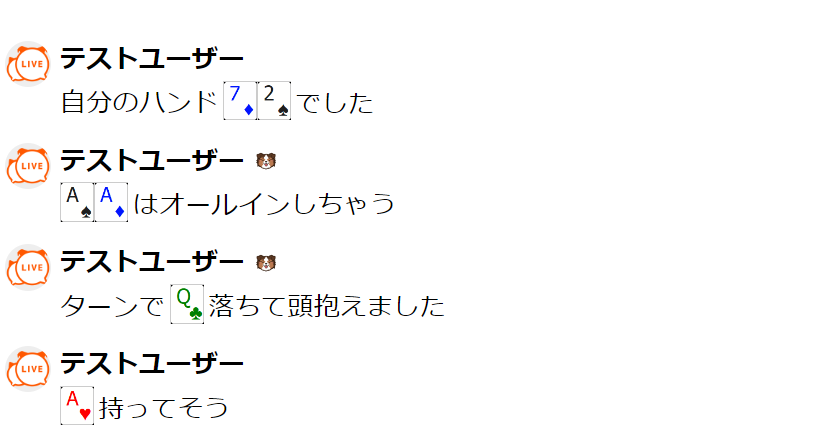

# onecomme-plugin-forpk

## Overview

コメント欄のトランプっぽいものを画像に置き換えて見た目を楽しくします！  
わんコメのほとんどのテンプレートに導入できます。

※このプラグインは [onecomme-plugin-formj](https://github.com/yuarasino/onecomme-plugin-formj) をフォークして作っています。ところどころ麻雀用のままになってますが、適宜 formj -> forpk に読み替えてください。　

## Requirement

わんコメ v4.0+ [Download](https://onecomme.com/)  
**v3.xを使っている人はアップデートをお願いします。**

## Download

わんコメプラグイン「forpk」  
[forpk-v1.0.0.zip](https://github.com/yuarasino/onecomme-plugin-forpk/releases/download/v1.0.0/forpk-v1.0.0.zip)

プラグイン導入済みテンプレート「basic4pk」  
[basic4pk-v1.0.0.zip](https://github.com/yuarasino/onecomme-plugin-forpk/releases/download/v1.0.0/basic4pk-v1.0.0.zip)

## Usage: 「basic4pk」テンプレートの導入方法

わんコメを使ったことがない人やbasicテンプレートを使っている人向けの「basic4pk」導入方法です。  
わんコメデフォルトの「basic」テンプレートに「forpk」プラグインを導入したテンプレートで、フォルダをコピーするだけですぐに使い始めることができます。

他のテンプレート(yurucampなど)を使っている人は、[Advanced](./docs/advanced.md)の項目を見てください。

手順: [Usage: 「basic4pk」テンプレートの導入方法](./docs/usage.md)

## Advanced: 他のテンプレートへの「forpk」導入方法

他のテンプレート(yurucampなど)を使っている人向けの「forpk」導入方法です。

手順: [Advanced: ほかのテンプレートへの「forpk」導入方法](./docs/advanced.md)

## Customize: テンプレートのカスタマイズ

導入後にテンプレートをカスタマイズしたいときの方法です。

手順: [Customize: テンプレートのカスタマイズ](./docs/customize.md)

## FAQ

### どの表記に対応していますか

hdsc表記に対応してます。A123456789TJQKとhdscの組み合わせです。

hdsc(半角)表記例: Jc, Kh5d

hdsc(全角)表記例: Ｑｃ, ＡｓＫｄ

### フレンドコードなどに「1p」などが入ってしまって変換されたくない

`フレンドコード: {a1pmj}` のように `{}` で囲むと変換されなくなります。

### フォントを変えたらカードがずれてしまう

こちらに修正方法があります。

手順: [Customize: テンプレートのカスタマイズ](./docs/customize.md)

### 自分の名前に「Ks」や「Td」が入っていて、変換してほしくない

こちらに修正方法があります。

手順: [Customize: テンプレートのカスタマイズ](./docs/customize.md)

## Contribution

ぜひ不具合報告や改善要望をしてもらえると嬉しいです！  
GitHubのIssueかTwitterのDMまでお願いします。

## Author

新篠ゆう [Twitter](https://twitter.com/yuarasino)

## License

GPL-3.0 [License](./LICENSE)
